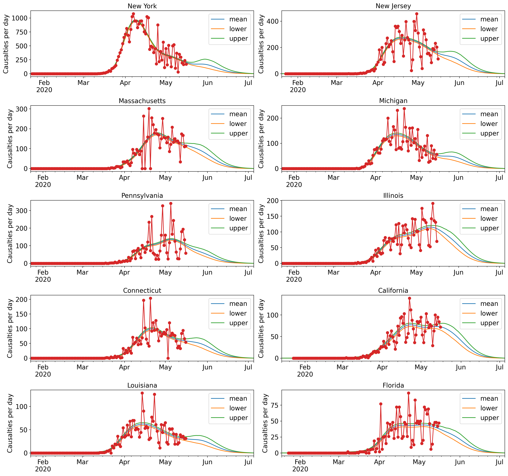
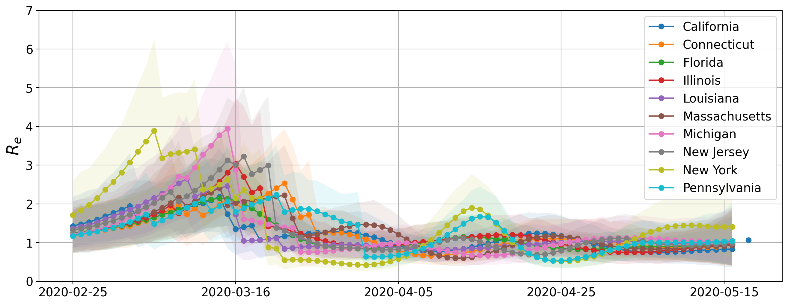
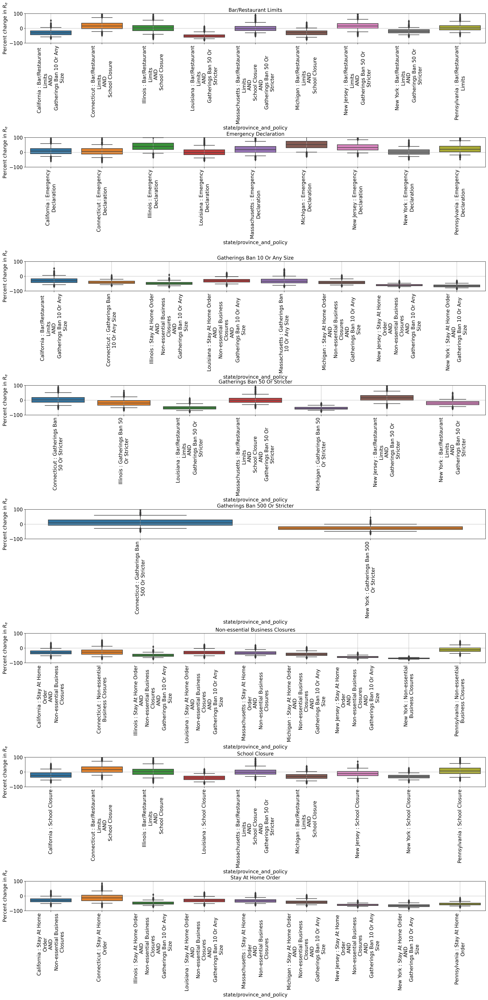

# Bayesian estimation of COVD-19 Infection time series and reproduction number

**THIS POST IS A WORK IN PROGRESS**

## Disclaimer 

This is a naive model I put together. I am not an epidemiologist and have made several assumptions (outlined below) which may not be totally justifed. Futhermore, development of the model and this post was not preceeded by a thorough literature review; it is possible that the objectives outlined below have already been acceptably addressed. Comments, suggestions, and critiques are welcome.

## Links

Github repo

Kaggle

## Motivation

Good estimates of the rate of transmission of COVID-19 (COVID) as a function of time are necessary to measure effecitveness of policies to reduce the spread this disease. One measure of transmission is  the effective reproduction number,$R_e$ , which is defined as  "[the expected] number of cases generated [by one case] in the current state of a population" (https://en.wikipedia.org/wiki/Basic_reproduction_number).  One way to estimate $R_e$ on a day $t$ is to divide the cases for which infection occurs on day $t$ by the sum of cases capable of transmission on day $t$. This gives mean number of new cases generated per day by a single case. Multiplying by the time interval over which a case is capable of trasmission gives $R_e$.

Although it is tempting to use the number of cases confirmed by testing as a proxy to the number of infections on each day this approach presents at least two difficulties:

1. A positive test for COVID occurs an unknown time period after infection
2. The proportion of cases that are detected depend on availability of tests 

Here, we use reports of death due to COVID on each day to estimate the proportions of individuals infected as a function of day. Previously estimated distributions of time between infection and symptom onset and between symptom onset and death (Lauer et al, 2020 and Verity et al. 2020) allow probabilistic statements about the day of infection given day of death. This addresses the first challenge above.  Moreover, it likely that COVID deaths were much more accurately measured than COVID infections (especially in the early days of the pandemic). If we assume that the probability that an individual becomes a COVID casualty is independent of the day they are infected then, by estimating the proportion of fatal cases with infection occurring on day $t$, we are also estimating the proportion of all cases with infection occurring on day $t$. This estimate should be less affected by sampling bias than estimates based on postive COVID tests.

## Objectives

The model and code below aim to estimate $P_t$, the probabilty that infection for a fatal case occurs on day $t$. This estimate and the assumption of statistical indepence between survival and the date of infection are used to calculate the $R_e(t)$ the effective reproduction number as a function of time.  We compare values of $R_e(t)$ before and after policy implementation in some of the US states hardest hit by COVID and try to draw conclusions about policy effectiveness.

## Model and Methods

Description of symbols:

- $(d)_{d=1}^{d_m}$ — the sequence of days for which we have casualty data for a population
- $I$ - day of infection of a single fatal case (a random variable)
- $E$ - day of observed event (in this case death but could also be hospitalization) for a single case (a random variable)
- $\mathbb{I}(\cdot)$ — indicator function (1 if true , 0 if false)
 - $(P_t)_{t=1}^{d_m}$  — A vector whose elements are probabilites that a casualty is infected on the corresponding day (A random vector in our Bayesian approach)
 - $(N_d)_{d=1}^{d_m}$ — A random vector represting the number of fatalities on day $d \in \{1,....d_m\}$
 - $(n_d)_{d=1}^{d_m}$ — the observed number of fatalities on day $d \in \{1,....d_m\}$
 - T — number of days an individual is capable of transmission post infection  (a hyperparameter)
 - $\mu$ — penalty strength for change in $R_e (t)$ a hyperparameter
 - `policy_factor` — amout by which penalty $$\mu$$ is reducted on days when policy change occurs ( a hyperparameter)

We estimate $(P_t)_{t=1}^{d_m}$  using a Bayesian approach — sampling from the posterior distribution $$\mathbb{P}\left( (P_t)_{t=1}^{d_m} | (N_s)_{s=1}^{d_m} = (n_s)_{s=1}^{d_m} \right)$$. To derive this distribution we calculate the likelihood function for observed death dates and explain our choice of prior.

### Likelihood for a single observation observation

The probabilty of death on day $s$ for a fatal infection condition that death occurs before the last date at which data is available is:
$$
\begin{align}
\mathbb{P}(E =s | \mathbb{1}(E \le d_m) = 1) &= \sum_{t=1}^{d_m} \mathbb{P}(E=s,I=t | \mathbb{1}(E \le d_m) = 1) \\
 &= \sum_{t=1}^{d_m} \mathbb{P}(E=s | I=t, \mathbb{1}(E \le d_m) = 1)\mathbb{P}(I=t | \mathbb{1}(E \le d_m) = 1) \\
 &= \sum_{t=1}^{d_m} \mathbb{P}(E=s | I=t, \mathbb{1}(E \le d_m) = 1)\frac{\mathbb{P}(I=t , \mathbb{1}(E \le d_m) = 1)}{\mathbb{P}(\mathbb{1}(E \le d_m) = 1)} \\
 &= \sum_{t=1}^{d_m} \mathbb{P}(E=s | I=t, \mathbb{1}(E \le d_m) = 1)\frac{\mathbb{P}(\mathbb{1}(E \le d_m) = 1| I=t)\mathbb{P}(I=t)}{\mathbb{P}(\mathbb{1}(E \le d_m) = 1)} \\
  &= \sum_{t=1}^{d_m} \mathbb{P}(E=s, \mathbb{1}(E \le d_m) = 1) | I=t) \frac{\mathbb{P}(I=t)}{\mathbb{P}(\mathbb{1}(E \le d_m) = 1)} \\
\end{align}
$$

Substituting for previously defined variables and distributions estimated in the literature.

+ First,  by definition of our random vector, $(P_d)_{d=1}^{d_m}$,
    $$
    \mathbb{P}(I=t) \equiv P_t
    $$
    
+ Second,
    $$
    \mathbb{P}(E=s| I=t) \equiv g(s-t)
    $$
    is the probability that death occurs on day $$s$$ given that infection occurs on day $$t$$. Assuming that the time from infection to symptom onset and from symptom onset to death are indepedent.  We can use the log-normal distribution from (Lauer et al, 2020) for time from infection to symptom onset and the gamma distribution from (Verity et al, 2020) for time from symptom onset to death to to obtain $$g(s-t)$$. 
    
    This distribution is plotted below. 
    
    </img>
    
    
    

Next, we can organize the values of $\mathbb{P}(E=s, \mathbb{1}(E \le d_m) = 1) | I=t)$ into a matrix $G$ with elements  
$$
G_{s,t} = g(s-t)\ ,\ \ \ s,t\in\{1,...d_m\}
$$
Then, in term of matrix $G_{s,t}$ and vector $P_t$

$$
\begin{align}
\mathbb{P}(E =s | \mathbb{1}(E \le d_m) = 1)  &=  \sum_{t=1}^{d_m} \mathbb{P}(E=s, \mathbb{1}(E \le d_m) = 1) | I=t) \frac{\mathbb{P}(I=t)}{\mathbb{P}(\mathbb{1}(E \le d_m) = 1)} \\
&= \frac{\sum_{t=1}^{d_m} G_{s,t}P_t}{\sum_{s'=1}^{d_m}\sum_{t'=1}^{d_m}  G_{s',t'}P_{t'}}  \ \ \ \ \ \ \ \ \textbf{[Likelihood single observation]}
\end{align}
$$

### Likelihood for multiple observations

From the above likelihood for a single observation of death date, it follows that the likelihood for $$n_s$$ deaths on days  $$s\in\{1,...d_m\}$$ is:
$$
\mathbb{P}\left( (N_s)_{s=1}^{d_m}  = (n_s)_{s=1}^{d_m} | (P_t)_{1}^{d_m} \right) = f\left( (n_s)_{s=1}^{d_m},  \left( \frac{\sum_{t=1}^{d_m} G_{s,t}P_t}{\sum_{s'=1}^{d_m}\sum_{t'=1}^{d_m}  G_{s',t'}P_{t'}} \right)_{s=1}^{d_m} \right)  \ \ \ \ \ \ \ \ \textbf{[Likelihood multiple observations]}
$$
where $f$ is the multinomial distribution.

### Bayesian approach and choice of prior

We could try to find $(P_t)_{1}^{d_m}$ that maximizes the likelihood of $(n_s)_{s=1}^{d_m}$. However, I observed that this tends to give a few spikes in $P_t$ separated by days with $P_t$ near 0. This is unreasonable since we expect individuals infected on a day where $P_t$ is at a local maxium to acquire their infection from individuals infected on previous days. To address this I changed to a Bayesian approach to estimating $P_t$.  I used a  prior $\mathbb{P}(P_t = p_t) \equiv h(p_t)$ of the from

$$
h\left( (p_t)_{t=1}^{d_m}\right) \propto \exp\left\{-\sum_{t=T+2}^{d_m} \mu(t, (p_{t'})_{t'=1}^{d_m})\left[  \left(\log(p_t) - \log\sum_{i=1}^{T} p_{t-i}\right) -  \left(\log(p_{t-1}) - \log\sum_{i=1}^{T} p_{t-1-i}\right)  \right]^2 \right\}
$$

To understand this choice of prior recall that $T>1$ is the number of days for which an infected individual can transmit the disease. Note:
- $\left(\log(p_t) - \log\sum_{i=1}^{T} p_{t-i}\right) = \log\frac{p_t}{\sum_{i=1}^{T} p_{t-i}}$ is the log of the ratio of the expected number of fatal cases infected on day $t$ to the expected number of fatal cases capable of infection on day $t$.  As discussed in **Motivation**, if the probabilty that an individual becomes a casualty is independent of date of infection then  $p_t$ is equal to the expected proportion of all infections occuring on day $t$ . Thus 

   $$
  R_e(t)  = \frac{p_t}{\sum_{i=1}^{T} p_{t-i}} \times T
  $$

- The square of the difference $ \left(\log(p_t) - \log\sum_{i=1}^{T} p_{t-i}\right) -  \left(\log(p_{t-1}) - \log\sum_{i=1}^{T} p_{t-1-i}\right) $ penalizes values of $(p_t)_{t=1}^{d_m}$ with dramatic changes in  $\log\left(R_e(t) \right)$ from one day to the next.

- $\mu(t,(p_{t'})_{t'=1}^{d_m})$ controls the strength of the penalty for rapid change. It can be choosen by specifying how much a paricular increase or decrease in $R_e(t)$ should decrease the probability of $p_t$ relative to no change in $R_e(t)$ between days. We indicate a $t$ dependence for $\mu$ since we expect days on which a new public helath policy (e.g. shelter in place) are implemented to have more dramatic change in $R_e(t)$. We indicate  $(p_{t'})_{t'=1}^{d_m}$ dependence for $\mu$  becuase on days of a newly implemented  public heath policy we relax the penalty if  $(p_{t'})_{t'=1}^{d_m}$  imples a decease in $R_e(t)$. Explicitly
   $$
   \mu(t) =
     \begin{cases}
       \mu_0 & t \text{ is not change in policy day}\\
       \mu_0 & t \text{ is change in policy day and } R_e(t) >  R_e(t-1) \\
        \mu_0\times \textrm{policy_factor} & t \text{ is change in policy day and } R_e(t) \leq  R_e(t-1) \\
     \end{cases}
   $$
   

### The posterior distribution and estimating $R_e(t)$

Combining the likelihood and the prior, the posterior distribution for  $P_t$ is 
$$
\mathbb{P}\left( (P_t)_{t=1}^{d_m} = (p_t)_{t=1}^{d_m}| (N_s)_{s=1}^{d_m} = (n_s)_{s=1}^{d_m} \right) \propto  f\left( (n_s)_{s=1}^{d_m}, \left( \frac{\sum_{t=1}^{d_m} G_{s,t}P_t}{\sum_{s'=1}^{d_m}\sum_{t'=1}^{d_m}  G_{s',t'}P_{t'}} \right)_{s=1}^{d_m} \right)  h\left( (p_t)_{t=1}^{d_m}\right)
$$
We sample from this posterior distribution using Markov Chain Monte Carlo (MCMC). Plots of $P_t$ illustrate the posterior mean with shading of a 95% credible interval.

### Estimating $R_e(t)$

The posterior distribution of $R_e(t)$ is calcuated from samples of $(P_t)_{t=1}^{d_m}$ using
$$
R_e(t)  = \frac{P_t}{\sum_{i=1}^{T} P_{t+i}}\times T
$$

Plots of $$R_e(t)$$ illustrate the posterior mean with shading of a 95% credible interval. 

### Change in $R_e(t)$  following policy implementation 

We measure the change in $$R_e(t)$$ before and after policy implementation by comparing the mean value of $$R_e(t)$$ over the 7 days before implementation of the new policy with the mean of $$R_e(t)$$ calcuated on the day of implementation and the following 6 days. The violin plots in **Results and Discussion** show the posterior distribtution of the percent change in these means.   

One issue with this "before vs after" approach is that several policies are frequenctly implemented in just a few days.  To address this, when policies are implemented on the same day they are treated as a single policy and given time same distribution of $$R_e(t)$$; when a second policy is implemented during the 6 day window following a first policy the 6 day window following the first policy is right truncated to prevent including in the mean values of $$R_e(t)$$  from days affected by the second policy. I feel this appoch is too adhoc. An improved approach might start with a model where R_e(t)  is a function of policies in place (see **Weakness and Future Work**).

### Policy enactment dates

Dates of policy enactment were curanted manually from a web search and then

## Results and Discussion

Results shown are for data fit on 5/14/2020. We consider the states with 10 most COVID casualties as of this date. Hyperparameter choices where
$$
\mu_0= 13. \\
\text{policy_factor} = 0.01 \\
T=7
$$

First let's demonstrate that the model can produce a good fit to oserved data. Note the y axis (not labeled : -( ) is the number of deaths per day. Red is the data an is obtained from (JHU). Lines show the posterior mean for the expected number of casualties on each day along with 95% credible intervals. These plots can be used to make pedictions about the average number of deaths occuring in the following days. Importantly these forecasts do not include any future infections and thus will underestimate mean numbers of deaths on future days with increasing underestimation on later dates.

Next, we'll plot estimated time-series for infections and effective reproduction number

Points of sharp decrease in $R_e$ are associated with some of the dates of policy change.  Although our piecewise definition of $\mu(t,(p_{t'})_{t'1}^{d_m})$ favors sharp change on these dates. We observe qualitatively similar results when $$\mu(t,(p_{t'})_{t'1}^{d_m}) = \mu_0$$  for all days.

Next, we make box and whiskers plots showing the posterior distribution of percent change in the mean of $$R_e(t)$$ on 7 days before and up to 7 days after implemention of new policies. As mentioned in **Model: Change in $R_e(t)$  following policy implementation **  the post-implementation interval is right truncated if it overlaps implementation of subsequent policy. *Note the plots are only available for the states and policies for which dates have been manually curated. They may be incomplete.*

The first collection of box and whiskers plots are organized by state. The x-axis labels policies and is ordered by date of implementation. When policies are implemented concurrently they are given the same distribution and separated by "AND".  The second collection is organized by policy. The x-axis labels states and also indicates additional policies implemented concurrently with the policy labeling the group. Plot whiskers indicate the 5th and 95th percentiles of the posterior distribution.

What conclusions can be drawn from these results? 

- For the 10 states cosidered $R_e$ has been at near 1 since the beginning of April 2020.  The value $$R_e=1$$ is important because effective reprocution numbers above this number imply exponential growth in the number of cases with doubling time:  ; while reproduction number below this value imply exponential decay in the number of cases with half-life :  . 

- The most dramatic and. (ususally latest adoped) policies: stay at home (aka shelter in place), non-essential business closures and bans on even small gatherings  are in almost evey case most effecitive in reducing $R_e$ . This is supported by the shift towards more negative percent change from left to right for box plots organized by state.   Overall this is not too surprising but it is important to be able to demonstrate quantitatively that  the personal and economic costs of these policies pay quick dividends in controling COVID spread.

- Less dramatic policies including school closures and bar/restaurant limits have mixed effectiveness. For example, bar and restaurant limits appear to have substantially reduced $$R_e$$ (along with other policies implemted concurrently) in Louisiana, California, Michigan and New York. This policy appears less effective in the other states cosidered.  Importantly, conclusions about the effectiveness of a policy acorss different states could be confounded by  the level of societal awarness of the COVID threat at the time of policy implementation. 

## Weakness 

- Policy dates are manually curated and this task is not complete. Efforts to produce single dates for policy implementation may not accurately refect nuances of practical implementation
- Transmission period of 7 days is choose arbirarily. It is ment to capture when an infected individual is likely to be in their normal routine and not taking extra precaution do to strong symptoms
- Implementation of multiple policies in a short perior of time (typically just a few days ) make resolving effects of indivdual policies difficult. 
  - Rather than estimating $(P_t)_{t=1}^{d_m}$  from data and then calculating  $R_e(t)$  it might be better the model  $R_e(t)$ as function of policies in place and fit policy coefficients to data.

## Future Work

- Formulate model where $R_e(t)$  is a response variable to covariates representing policies in place
- Apply model to states as public health policies are lifted

## References

Lauer et al. 2020. "The Incubation Period of Coronavirus Disease 2019 (COVID-19) From Publicly Reported Confirmed Cases: Estimation and Application". _Annals of Internal Medicine_

Verity et al. 2020. "Estimates of the severity of coronavirus disease 2019:a model-based analysis" _Lancet_

### Acknowledgments

I would like to thank my two brothers who helped with data curation and writing code.