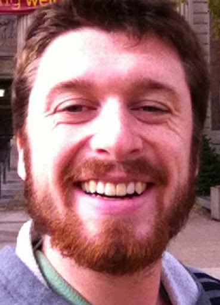

Alex received his BA in math and BS in physics from Washington and Lee University in 2012. He received his PhD in physics from the University of Illinois, Urbana-Champaign in 2020. During grad school, he developed and applied physics-inspired techniques to understand patterns in biological sequences that underly predictions of machine learning models applied to genomics data.  He is broadly interested in applying statistics, machine learning and computing to complex problems relevant to the well-being of individuals and of society.

Some Links
- <a href="https://www.linkedin.com/in/alex-finnegan-33b4b0126/">Linkedin</a>
- <a href="https://scholar.google.com/citations?user=2GLEnlUAAAAJ&hl=en">Google Scholar</a>

